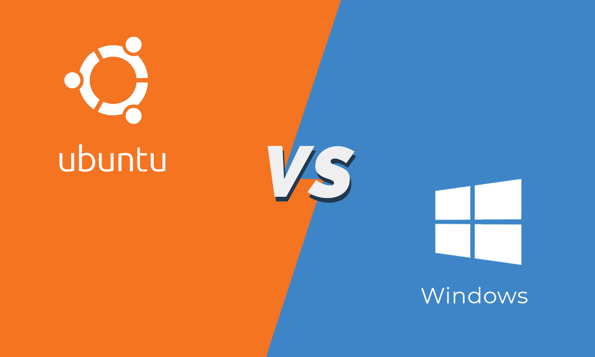

## A Comprehensive Comparison of Windows and Ubuntu
### S M Asiful Islam Saky

**Table of Contents**

*Abstract*

1. Introduction
1. Literature Review
1. Methodology
1. Results and Discussion
1. Conclusion

*Reference*

**Abstract**

*This report is a comprehensive comparison between two of the most widely used operating systems, which are Windows and Ubuntu, a Linux distribution. Several dimensions of comparison will be utilized, such as user interface, system performance, security, software options available in the market, hardware, community and support, plus cost and license. While Windows is like an eye-catching OS, Linux is the safest. Windows can be crashed in any important work as it requires the latest updates to work smoothly but Linux updates can occur during the operational works without interfering with any other tasks. Also there are many more parameters needed to be worked on during the comparison. For the results and findings I've seeked out many real life feedback from the users according to their usages in different matters. The purpose of the comparison is to identify the differences and similarities between the OS, relative to the standards and requirements of an end user, an individual, or an organization.*

1. **Introduction**

Operating systems (OS) are the backbone of modern computing. It provides the necessary infrastructure for software applications to interact with hardware. There are many types of operating systems and in recent years, Windows and Ubuntu stand out as two of the most widely used and influential operating systems. Windows is a proprietary OS developed by Microsoft. It is widely used for its user-friendly interface and extensive software compatibility. On the other hand, there are many Linux distributions but Ubuntu is a popular Linux distribution maintained by Canonical, and is celebrated for its security, performance, and open-source nature. These operating systems have their own features and advantages and disadvantages according to the usages of the users and different perspectives. Here in this report, there will be a comprehensive comparison between these two operating systems evaluating them across various dimensions to offer a clear understanding of their respective advantages and limitations.

*Figure: Desktop of Windows(Left) and Linux (Right)*

2. **Literature Review**
1. **Background of Windows**

Windows was first released in July 2015. Previously there were several windows developed by Microsoft such as Windows XP, Windows 7, Windows 8.1. Etc but the development of Windows added a significant evolution in the Windows family of operating systems. It integrates features from Windows 7 and Windows 8, aiming to offer a balance between traditional desktop and modern touch-based interfaces. Windows is popular for continuous updated model releases. These added new features and security improvements regularly. Key features are the Start Menu, Cortana (a virtual assistant), Edge browser, and support of the hardware changes.

2. **Background of Ubuntu**

Ubuntu (Focal Fossa) is one of the most popular Linux distributions for a long period of time. It is a widely used Ubuntu version till now firstly released in April 2020 ensuring five years of support and updates. In case of stability, security and extensive customization options, Ubuntu is considered as the most popular operating system. As the desktop environment it uses GNOME which provides a modern and efficient user experience. It is an open-source operating system that encourages community involvement and contributions, leading to a robust and versatile platform.

3. **Previous Comparisons**

In the previous years, numerous studies and research articles have compared Windows and Linux-based operating systems where the considered key points of comparison often include system performance, security, user interface, and software availability. The facts can be seen as Windows is generally favored for its ease of use and broad software compatibility, on the contrary, Linux distributions like Ubuntu are praised for their security, performance, and cost-effectiveness. In this report the existing comparisons will be enhanced focusing on the specific versions of Windows and Ubuntu , incorporating the latest features and updates.

3. **Methodology**

The methodology of this report includes the comparison of two different operating systems, Windows and Ubuntu on the basis of seven key areas stated below.

1. User Interface (UI)
1. System Performance
1. Security Features
1. Software Ecosystem
1. Hardware Support
1. Community and Support
1. Cost and Licensing

For the data and information collection, the following approaches have been followed:

1. Reviewing Official Documentation
1. Testing on Virtual Machines
1. Consulting Online Resources

For the real-life scenario of the user preferences in terms of their works and activities an investigation has been performed on user communities, forums, and support channels. Their feedback has helped the comparison to make the comparison better which will be described below.

1. **User Interface (UI)**

Windows is designed with a user-friendly interface in Graphical and it combines the traditional desktop interface with a modern touch. For starting operating, the start menu is the central feature that offers quick access to applications and live tiles for updates. As it is designed beginner friendly and intuitive, anybody can easily use it who has the experience with previous windows versions. Another addition here is the Cortana and the Action Center which enhances its usability. Users can customize their start menu, taskbar and desktop background. There are different desktop themes that have wonderful scenarios users can apply and can also create and download from online. It also supports a dark mode, providing a degree of customization. Overall user interface of Windows is generally smooth with well designed features.

Ubuntu uses the GNOME desktop environment which is clean and modern. The Activities Overview provides an efficient way to manage open windows and workspaces. It operates mostly on Command Line Interface or CLI. And the CLI commands are almost similar with other Linux distributions. When a user will learn these commands, operating Ubuntu will be easier for him. It includes tools like GNOME Shell extensions to enhance functionality. It is highly customizable that a user can even delete the function ‘setting’ also they can change themes, icons, and even the desktop environment if desired. While Windows is expensive and you have to pay for use, Ubuntu is free and open source that offers a stable and responsive experience. It is favored by developers and power users for its flexibility and powerful command-line interface.

2. **System Performance**

Windows typically takes longer time to boot or starting on especially in older hardware but with the recent SSD, it somehow coped up with this scenario. As there are many background processes going on in Windows, the responsiveness might be slow, another reason is frequent updates. Windows requires more power and resources like, it consumes more RAM and CPU due to the background services and applications. But in Windows the multitasking capabilities are higher as it has features like Task View and virtual desktops. Overall the system performance in Windows depends on the hardware and typically slow in older systems.

Ubuntu is considered for the faster boot times, especially on SSDs. Ubuntu's lightweight nature contributes to quicker startups. It is highly responsive, even on older hardware. Efficient resource management ensures smooth operation. Ubuntu requires less resources and is more efficient in terms of CPU and RAM usage that ensures better performance in any machine. Ubuntu has workspaces which ensures excellent multitasking abilities, allowing users to organize applications efficiently. In the matter of system performance, Ubuntu will take a place at the top position than Windows for its lightweight nature and better performance.

3. **Security Features**

Windows has a bit-locker that ensures disk encryption enhances the security. In this case data can not be shown without the permission of the administrator. Windows is developed with the built-in Windows defender software that works for defending malware like an antivirus. Windows has a nature of rapid updates that ensures better security and to cope with the vulnerabilities. But as Windows is more popular for its user-friendliness, the vulnerabilities are higher in Windows than other systems as the hackers have a sharp target always at Windows.

Ubuntu uses sudo for administrative tasks, providing robust access control. AppArmor and SELinux offer additional security layers. It supports full disk encryption and home directory encryption during installation. Ubuntu has lower risk of malware compared to Windows and the users can install ClamAV for additional protection. The regular security updates and patches in Ubuntu ensures better security and the open-source nature allows the community to quickly identify and fix vulnerabilities. To sum up, Ubuntu ensures better security than Windows for various reasons that are stated above.

4. **Software Ecosystem**

Windows has Microsoft Store and many more sites for the software as for Windows, it has an extensive software library with much more commercial software and games. In any category software, Windows is more compatible to install by the users and popular for smooth runs. There are simple ways to install Windows software by just executing the .exe files. This is somewhat easier than Linux or Ubuntu and preferable by the users. Point to be mentioned, along with software, Windows has a wide range of games that has attracted all the users for updated high graphics and better stability and smoothness.

Ubuntu has a strong software repository, particularly for open-source applications that ensures the software diversities and availability. It has tools for developers, like Docker and Git, and office suites like LibreOffice. Mostly, when popular software is released, it is released for Linux version also and also the open-source community works on to find out the alternative one that’s why Ubuntu is generally compatible with open-source software. However, some commercial software and games may not be natively supported. In Ubuntu, software installation through the APT package manager or snap packages ease the processes of software installation and management. While Windows is better for the software availability and compatibility, Ubuntu is excellent for open-source software and development tools.

5. **Hardware Support**

Windows is compatible with a wide range of hardware for its availability and mostly the drivers are supported by the manufacturers. But for Windows as it is fastest growing along with the updates and enhancement of hardware, sometimes difficulties can be seen while installing updated versions of windows in an older system. As Windows requires higher storage and CPU, it has a requirement to install in the systems. But the other hardware supports are given by Windows in case of driver installation and compatibility.

Ubuntu has good compatibility, particularly with open-source drivers that ensures smoothness of operations. However, some specialized hardware may require additional configuration. Ubuntu includes strong support for most hardware, though users may need to manually install drivers for certain devices. The most important comparison in case of hardware, Ubuntu is more compatible with even the older-spec computers or systems. For lightweight, Ubuntu runs smoothly in Raspberry PI PC and can be used in robotics too. Ubuntu is highly configured in any cases.

6. **Community and Support**

Windows has comprehensive support through Microsoft, including online documentation, forums, and customer service. Moreover, it has an active online community with numerous forums, blogs, and user groups for any solution and enhancement of usages. Users feel difficulties while working in a new environment or sometimes face problems or troubles working with some software or system. Hence, Windows has extensive resources including tutorials, troubleshooting guides, and third-party support to help users to ensure best usage. Any problem faced, it has solutions in the official Microsoft help site, including blogs and tutorials in YouTube by experts.

Ubuntu has professional support available through Canonical, particularly for enterprise users. For the user manual and the guides, Ubuntu has an extensive documentation. It has a strong and active community involvement with forums like Ask Ubuntu and Ubuntu Forums. Abundant resources including official documentation, community wikis, and third-party guides ensures the availability of resources and best community support for all the time. Overall, while both Windows and Ubuntu has its own strong community and support, Ubuntu has an active community from the users of itself with active involvement and comprehensive documentation.

7. **Cost and Licensing**

Windows is not free, it's a proprietary software that requires a purchase of a license. With a wide range of editions available including Home, Pro, Enterprise that have different costs. Windows is generally expensive including most of the software used in this environment. Users have to buy the licenses of the software they use also for the operating system. As it has a value proposition, the software and systems are regularly updated with enhancement in terms of features and operations. As per the licenses are proprietary licenses, it requires high cost to buy and install Windows. But sometimes, it can be seen that the users are using cracked versions of these which are not safe and secure.

Ubuntu is an open-source software available for free for everyone. Users can modify and distribute the OS under the terms of the GNU General Public License (GPL). Ubuntu is free to use but has a paid version too for the additional paid support from Canonical for enterprise users. The software users install is free and open-source, no need to pay for any. So, no costs needed for Ubuntu installation and hence, no crack versions of these that ensure high security and smoothness of the features of the software. To conclude, Ubuntu is free to use with its vast features and extensive resource of applications, windows requires a lot of costs as the OS and software are more expensive.

|**OS**|**Availability (source-code)**|**User Modification**|**Usability(user- friendliness)**|**Security**|**Cost**|
| - | :- | :- | :- | - | - |
|Windows|Proprietary (Expensive)|User cannot modify in OS independently|Window provides Ease of use and a nice GUI|Improved security than the previous version but still not that secure.|The cost of software and OS is high as it is proprietary.|
|Linux (Ubuntu)|Open-source (Free to use)|Users can easily Modify the OS as source code freely available|
Widely used by programmer s and gained much attention in

a few years.
|Very Secure and safe to use.|Everything is community- based and freely or less costly available.|

*Table: Brief Comparison between Windows and Linux*

4. **Results and Discussion**

Although major works on this project on a very specific version of Windows and Linux distribution that is Windows and Ubuntu, the cases are almost the same for the versions from the same races of OS. From the survey on a decent number of people, users of Windows, Linux,

we have found considerable differences in the context of preferences on a basis of users’ expertises and uses on certain matters also based on their professional roles. The results from the survey will be described and discussed in this section. Firstly, the pie chart depicts the data of the Windows and Linux users. As we can see, the number of Windows users are higher than the number of Linux users.

*Figure: OS Preference*

In case of user interface or UI, people's preferences towards Windows as it is graphical user interface(GUI) which is user friendly whereas Linux having Command Line Interface or CLI which requires a bit of expertises.

*Figure: User Interface*

On the basis of System Performance the preferable OS is Linux as this OS is lighter than Windows and more compatible with a comparably lower level of hardware, stated by the survey.

*Figure: System Performance*

While windows requires a vast amount of properties in the hard drive, Linux consumes very less amount of storage space. On the other hand, in case of memory management, Linux will be on the top. Also the same case for the CPU, even Raspberry PI PC can install Linux smoothly. So, the! hardware compatibility is far more better for the Linux than windows, from the people’s preferences of the survey:

*Figure: Hardware Support*

In terms of security, undoubtedly Linux is the best. Linux is more secure than Windows. It is one of the most important reasons behind choosing Linux by the users.

*Figure: Security Features*

Cost and Licensing, the matter is both hardware and software, but in this case, more related to the software. As comparable light hardwares are also compatible for Linux, it requires less cost than Windows. On the other hand, the Linux softwares is mostly open source, contributed by the community for free of use, free of charge. Hence, very less cost for Linux than Windows.

*Figure: Cost and Licensing*

In the matter of Windows vs Linux as an operating system, the survey gives a good understanding on the matters of operating system which one is more preferable to whom.

5. **Conclusion**

The comparison of Windows and Ubuntu reveals that both operating systems have distinct strengths and cater to different user needs. Windows excels in user-friendliness, software compatibility, and hardware support, making it a strong choice for general consumers and business environments. Ubuntu , with its robust security, performance efficiency, and cost-effectiveness, is ideal for developers, IT professionals, and users seeking a customizable and open-source operating environment. Every OS has its own advantages and disadvantages in terms of usage and industry facts and purpose of usage. For applications, similar works can be done in every environment similarly with alternative applications. But for the Linux operating system our study found it easier with cost effectiveness and security, while Windows has problems with higher expenses to buy licenses. Another factor to compare is the storage and resources required for these two different OS. While Windows is requiring higher-spec of hardware, Linux is lightweight to be installed and works smoothly in older and lower-spec hardware. That’s how these two OS differentiate with each other respectively in terms of different perspectives.

***References***

1. *Microsoft. (2020). [Windows Specifications](https://www.microsoft.com/en-us/windows/windows--specifications).*
1. *Canonical. (2020). [Ubuntu Release Notes](https://wiki.ubuntu.com/FocalFossa/ReleaseNotes).*
1. *"Windows vs. Linux: What's the best operating system?" ZDNet, April 2020.*
1. *"Ubuntu 20.04 vs Windows : Which one to choose?" LinuxHint, May 2020.*
1. *"The Ultimate Guide to Windows ," PCWorld, July 2020.*
1. *"Ubuntu : Everything you need to know," TechRadar, April 2020.*
1. *"Operating System Security: Windows vs. Linux," CSO Online, March 2020.*
1. *"Performance Comparison: Windows vs. Ubuntu 20.04," Phoronix, April 2020.*
1. *"Software Ecosystem in Windows and Linux," InfoWorld, May 2020.*
1. *"Community and Support: Windows vs. Ubuntu," OpenSource.com, June 2020.*

## ***Video Link:** [A Comprehensive Comparison of Windows and Ubuntu](https://youtu.be/LBscdGxdP8U)*
